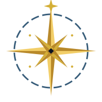

# Aerendil

  

**At this time Aerendil is not a working product, but very much a WIP**

Aerendil is an opinionated Feature Flagging toolkit designed from the ground up to handle large amounts of connections and requests.
This makes Aerendil highly efficient for distributed/cloud-based workloads running in Containers or on Kubernetes platforms.  
To accomplish this Aerendil operates at the OSI Layer 4 TCP level using raw sockets, rather than the HTTP/WebSocket layer, with the FQDP protocol designed for Feature Flagging in distributed systems.

The core design principles for Aerendil are as follows:

- Developer focus should lie on developing the features, not the flagging systems
- It must support a large set of programming languages
- It must be able to handle a very large request rate for distributed workloads

## Usage

Aerendil provides a raw TCP-based feature flagging service using the FQDP protocol. Clients can connect to query and subscribe to feature flags in real-time.

For a high-level project overview, see the [Aerendil premise document](./docs/premise.md).

For detailed usage examples and API documentation, please refer to the [documentation](./docs/).

## Protocol

Aerendil exposes the FQDP (Feature Query & Definition Protocol) over TCP for efficient feature queries and subscriptions. See the FQDP specification for details: [docs/fqdp.md](./docs/fqdp.md).

## License

This project is licensed under the MIT License - see the [LICENSE](./LICENSE) file for details.
